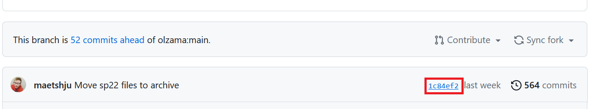

## Assignment 1: Preliminaries

In this assignment, you will:

* Download the data you will be working with in all (or most) of the assignments.
* Start thinking about language data in data science and machine learning terms.
* Create and start using a personal repository on GitHub where you will store your code for the class.
* Start learning how to program in Python using VS Code.
* Learn how to connect to a remote server and run Python and Git there.

Submission summary:
* Part 1: A text file answering questions about the IMDB review dataset.
* Part 2: Private GitHub repository created; `siyuliang` added as a collaborator.
* Part 3: A file **called your-UW-NetID-assignment1.py** in your repository
* Part 4: A screenshot of your program output from the command line, and a document containing the link to the GitHub repository commit.

> This assignment covers a lot of setup. Go through it one part at a time. Post questions to the Canvas Discussion Board or come to office hours.

### Part 1: The IMDB review dataset

We will be using the IMDB review dataset ([Maas et al. 2011](https://www.aclweb.org/anthology/P11-1015.pdf))
1. Download and unpack the dataset from [here](https://ai.stanford.edu/~amaas/data/sentiment/). **Windows users:** download the ZIP version at Canvas→Files→aclImdb.zip instead, since Windows cannot open TAR.GZ by default.
1. Read the README file that comes with the dataset.
1. In a text file, answer the following questions about the dataset:
   1. How many movie reviews does it contain?
   1. How is the dataset divided? (Here, talk about how many reviews are in each folder and what each folder represents, in your own words. Do not copy the text from the README file.)
   1. **Why** is it divided in this way? (Make sure to give a thoughtful answer here, at least a paragraph! You may not yet know everything about this, but answer the best you can, based on what you learned in the first couple weeks of class.) (**NB: Complete closer to the due date!**)
   1. Why is a citation to the ACL paper by Maas et al. included in the README file and in the dataset description on the website? (**What is the relationship of the paper and of the dataset?** Thoughtful, paragraph-length answer here.)
   1.  Why is there a reference to Potts's paper?
   1. Would you say this README file qualifies as a "data statement" (see Bender and Friedman, 2019, which was assigned earlier). If yes, point to the specific portions of the file and map them to corresponding definitions from Bender and Friedman's paper. If no, explain what a data statement could look like for such a dataset or why the concept does not apply here. You can of course argue against data statements here if you like! It is up to you; what counts is the depth and quality of argument. 
1. Submit your text file **to Canvas**, in the appropriate area associated with Assignment 1.

### Part 2: Git and Your GitHub repository (NB: Complete what you can now and the rest after April 9.)
In this part of the assignment, you will create a GitHub repository for your code in this class.
1. Create an account on https://github.com/
1. Create a new repository; make it private. Call it whatever you like, but you will use it for this class.
1. After you've created the repository, note its https:// address.
1. Go to Settings and add `siyuliang` as a collaborator (**NB:** this counts as your **submission** for this task).
1. Now, install git on your machine. Click on the "Click here to download" button [here](https://git-scm.com/downloads) 

### Part 3: Python and VS Code. (NB: Complete what you can now. You should be able to do everything after April 9.)
In this part of the assignment, you will use VS Code to work with Python and GitHub. You should already have Python and VS Code installed from lecture and should already know that both are working.

Use the official VS Code guide here:

<https://code.visualstudio.com/docs/sourcecontrol/github>

You may use an LLM to help you with setup and navigation for this part.

Your goals for this part are:

1. Sign in to GitHub from VS Code if prompted.

1. Clone the repository you created in Part 2 and open it in VS Code.

1. Create a Python file called **your-UW-NetID-assignment1.py**.

1. Write a short Python program that prints something.

1. Stage, commit, and push the file to GitHub from VS Code.

1. Verify on GitHub that the file is present in the remote repository. This counts as your submission for this part.

1. Edit your README on the GitHub website and add your full name.

1. Pull the updated README back into VS Code.

### Part 4: Command line and remote servers. (NB: Complete after April 9)

Being comfortable on the command line is an important skill. Try your own computer first (Option A); use Patas (Option B) if you prefer or need to.

#### Part 4 option A: Using your own computer

Mac/Linux: use `Terminal`. Windows 10/11: use PowerShell, CMD, or [WSL](https://learn.microsoft.com/en-us/windows/wsl/install).

1. Open your terminal and use `cd` to navigate to a working folder.
2. [Install Git if needed](https://git-scm.com/book/en/v2/Getting-Started-Installing-Git), then run `git clone your-repo-address`. Authenticate if prompted.
3. `cd` into the cloned folder and run your Python program.
4. Take a screenshot of the output for your Canvas submission.

#### Part 4 option B: Using Patas

1. SSH into patas: `ssh your-NetID@patas.ling.washington.edu`
1. Run `git clone your-repo-address`. Authenticate if prompted.
1. `cd` into the cloned folder and run your Python program.
1. Take a screenshot of the output for your Canvas submission.

#### Part 4 deliverables

1. Go to your GitHub repository and locate the commit link toward the top of your repo. (See below image.)

2. Click the link and copy the URL. Add it to a text file/document and submit to Canvas along with your screenshot of the program output.

You are now **DONE** with Assignment 1! **Don't forget to submit the file for Part 1 to Canvas**. In Assignment 2, you will already be writing programs and running them on the IMDB review data!
